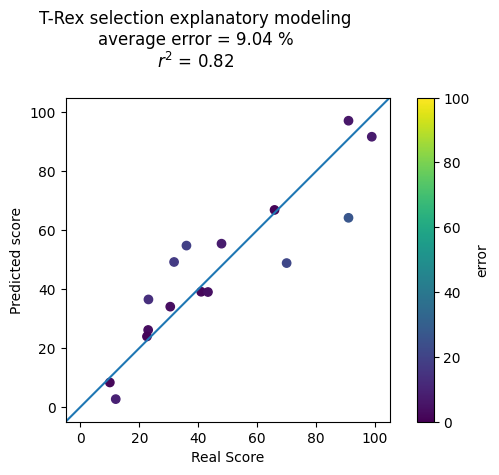
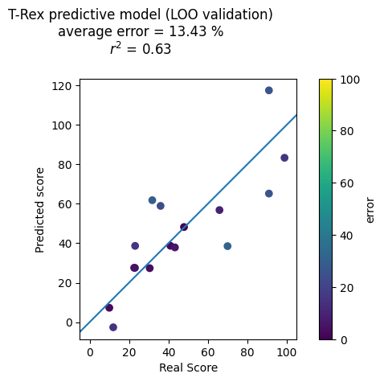

<h1 align="center" > FLOCK - Feature Learning of Organized Collective Kinetics </h1>

Welcome to the FLOCK-GPS repository

The purpose of this package is to serve as a processing and feature extraction toolkit for assessing group movement dynamics from GPS location data.

## Documentation
Documentation can be found in the [Docs](./Docs) folder of this repository

## Quick start

The [tutorials](./Tutorials) folder contains a walkthrough for each preprocessing and feature extraction step, while the [ExtractAllFeatures](./ExtractAllFeatures.py) script shows how to combine and run all processing and extraction. 
To run the predictive modeling analysis, fist instantiate your R home in the [Predictive-Modeling](./PredictiveModeling) notebook.

## FLOCK functions

* **DataLoading.py**
  * Functions for loading and re-formatting data from a directory of .csv files
  * See the SampleData folder for input data format examples
  * GPX data from different devices can be formatted uniquely, data is assumed to be in teh format of the example .csv files in the [SampleData](./SampleData) folder 
    
* **Preprocessing.py**
  * Preprocessing functions such as outlier sample detection, interpolation of missing datapoints, path smothing and break detection for identifying movement periods
    
* **VelocityFeats.py**
  * Feature extraction functions for finding the velocity of each individual over time and features related to difference in velocities across group members
  
* **SpatialFeats.py**
  * Feature extraction functions for spatio-temporal features (spatial features over time). Such as the stretch index, convex hull surface area and voronoi spaces

    
   
 <em>Spatial features such as distance to centroid (stretch index), convex hull surface area, and voronoi spaces</em>

* **PACS.py**
  * Path-adapted coordinate system transformation

       
   
 <em>Path-adapted coordinate system example. The leftmost figure shows the raw path and one timepoint while the next figures show the straightened PACS path and coordinates of group members over a time-window in the PACS space.</em>

* **PacsFeats.py**
  * Feature extraction for path adapted coordinate system tranaformed data. Such as the spatial exploration index of each individual, the nearest neighbor (left/right and front/back), the length/width ratio of the group and the consistency of member positions in different movement periods
  
* **DirectionalCorrelation.py**
  * Directional correlation time delay leadership metrics from [Nagy et. al.](https://www.nature.com/articles/nature08891) including the directional correlation time delay for each individual, Highly correlated segments (HCS) for each pair and directed graph representation of the directional correaltion time dealy leadership heirarchy for each movement period  

  
   
 <em>Leadership heirarchy from the directional correlation time delay analysis</em>

* **ClusteringFeats.py**
  * Features from clustering analysis using a density-based clustering method (DBSCAN) and/or a heirarchical density-based clustering method (HDBSCAN)

    
   
 <em>HDBSCAN clustering in action, tick lines are 5m apart Outliers are labelled cluster -1 Plotly express doesn't allow for categorical legends in scatter animations</em>

* **Regularity.py**
  * Movement regularity feature extraction including PACS coordinate entropy for each individual at each movement period, Vector autoregression with and without exogenous varaibles for predicability of each individual's movement over time, and entropy measures for all features that are calculated over time
 

## Predictive modelling
Case study: During a 72 hour field study, 16 groups of soldiers complete a 'loaded ruck march' before engaging in strategic and tactical exercises the next day. During these exercises, experts score each of the groups. Our goal is to predict the expert's score of each group from features calculated with this toolbox during the loaded ruck march. To select features, we employ the [Terminating Random Experiments (TRex)](https://github.com/jasinmachkour/TRexSelector) method. We then train a linear regression model using only the selected features.

* **Explanatory model**
  * Here we use all of our datapoints (16 groups) to select important features and we report the model's performance on the training data. This exploratory model achieves an R squared score of 0.82.

       
   
 <em>Explanatory Model Results</em>

* **Predictive model**
  * Here we employ a Leave-One-Out cross validation method, where we select features and train a new model for each iteration, then test the model on the left out datapoint. This predictive model achieves an R squared score of 0.63.

       
   
 <em>Predictive Model Results</em>

**Why the T-rex selector?**  
Compared with a basic Least Absolute Shrinkage and Selection Operator (LASSO) feature selection method, the TRex achieves a much higher stability (i.e. the selcted features in each Leave-One-Out iteration are more similar). The LASSO struggles with wide datasets (small number of observations and large number of features), especially when there is a low sparsity (a high amount of relevant features) such as with our sample study dataset.

